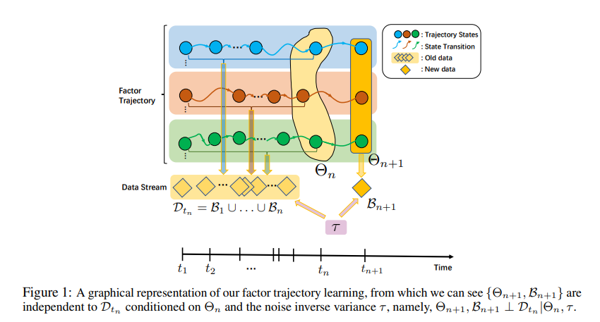
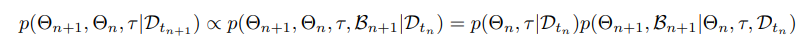

# Streaming-Factor-Trajectory-Learning
This authors' official PyTorch implementation for paper: Streaming Factor Trajectory Learning for Temporal Tensor Decomposition(NeurIPS 2023)


## Methods Overview:

### Each factor is a time-varing and uncertainty-aware function
To model the temporal tensor data, we assign each tensor factor with Temporal-Gaussian Process priors and model it as the continuous-time-varing trajectory.


### Online algorithm for streaming data: 
The inference of the factor trajectory is in a streaming and online manner.



## Requirements:
The project is mainly built with pytorch 1.10.1 under python 3. Besides that, make sure to install [tqdm](https://tqdm.github.io/) and [tensorly](http://tensorly.org/stable/index.html) before running the project.

## Instructions:
1. Clone this repository.
2. To play with the code quickly, we offer two notebooks at `code_fang\notebook`(on synthetic & real data)
3. To run the real-world datasets with scripts, run `code_fang\script_BCTT.sh`

Check our paper for more details.

## Citation
Please cite our work if you would like it
```